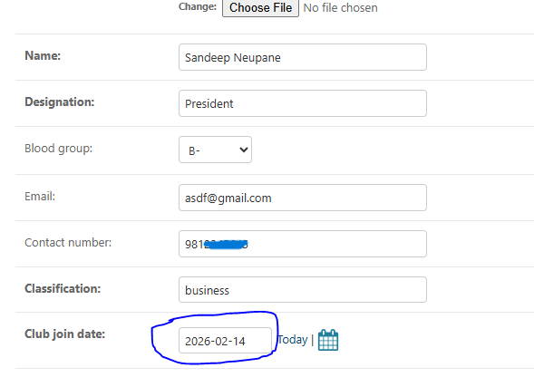

# Bug #1: Invalid Future Date Allowed in "Past President" Upload

**Description:**  
While manually testing the "Past President" upload form, I found that it allows submission with a **future date**, which should not be permitted. This indicates missing server-side (backend) validation, as the form still submits and stores the data even with incorrect input.

**Steps to Reproduce:**  
1. Go to the admin dashboard → Past Presidents section  
2. Click on "Add New" or "Upload Past President"  
3. Fill in the required fields  
4. In the "Date" field, select a **future date** (e.g., 2026-01-01)  
5. Submit the form

**Expected Result:**  
The form should **not submit** and should display a message like:  
`"Date cannot be in the future for a past president."`

**Actual Result:**  
The form is submitted successfully, and the entry with a future date is saved. This was tested through the UI, but it shows that backend validation is missing since it accepts invalid input.

**Screenshot:**  

**Severity:** Medium to High  
**Tools Used:** Trello, Chrome DevTools(for verifying frontend behavior)
**Status:** Open (Reported)

**Suggested Fix:**   
- Implement backend validation to ensure date is not in the future
