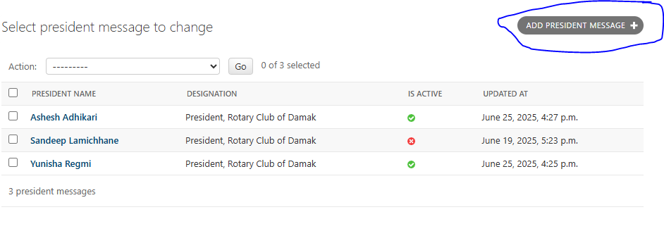

# Bug #2: Multiple "President Messages" Can Be Submitted

**Description:**  
While manually testing the "President Message" section, I observed that the system allows **submitting multiple messages**, even though logically there should only be **one active President Message** in the database at a time. This indicates that there is **no backend restriction** preventing duplicates.

**Steps to Reproduce:**  
1. Go to the admin dashboard -> President Message section  
2. Click on "Add President Message"  
3. Submit a message  
4. Repeat the process to add another new message  
5. Check the frontend or database entries - multiple messages are added

**Expected Result:**  
- Only one President Message should be allowed  
- The "Add President Message" button should be **disabled or hidden** once a message is added  
- System should only allow **editing** the existing message, not creating new ones

**Actual Result:**  
- I was able to submit **multiple messages** through the database  
- Each new message was added as a separate entry  
- No restriction or validation stopped me from adding another one

**Screenshot:**  

**Severity:** Medium  
**Tools Used:** Trello, Chrome DevTools(for verifying frontend behavior)   
**Status:** Open (Reported)

** Notes from Manual Testing:**  
- There was no database indication that only one message is allowed  
- After submitting one message, the "Add president message" button was still active  
- I verified multiple entries from the message list

**Suggested Fix (for dev team):**  
- Add **backend validation** to restrict the system to a single President Message  
- Prevent insertion if one already exists — allow only **update/edit**  
- disable or hide the "Add President Message" button in the database after the first message is submitted
